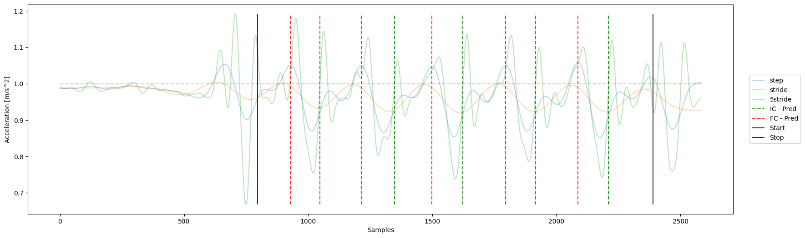

# Filtering-based stride segmentation

This code provides a Python implementation of the filtering-based algorithm for gait event detection proposed by Reed Gurchiek et al. (2020). The original implementation was in MATLAB. In short, the algorithm uses different low-pass filtered acceleration signals to determine the time points of initial and final contacts during walking based on data from a single thigh-worn accelerometer. The paper can be found here: [Gait event detection using a thigh-worn accelerometer, Gait&Posture](https://doi.org/10.1016/j.gaitpost.2020.06.004).

Pleas note: 

(1) The implementation of the minima correction (used to identify potentially faulty instances of local minima in the stride frequency-filtered signal) needs to be further validated.

(2) Some of the implementation regarding the minimal and maximal allowed stride times is still missing.

**Figure 1** Example of filtered acceleration signal and the predicted IC and FC events. 

